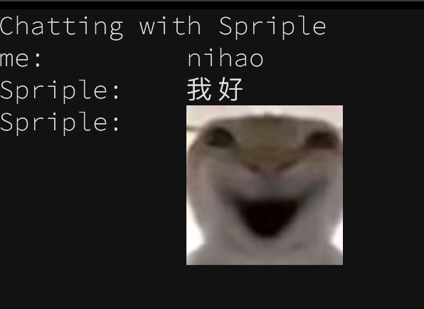

## log
计划把群组列表，获取消息历史，发送图片这三个功能完善之后，发布0.0.1版本
之后的事情就再说
2025.1.22
开发好了既可以塞图片和文字的聊天窗口


## bugs
1. front运行时出现不存在的消息和日志系统不兼容问题
```
Received message: {'status': 'ok', 'retcode': 0, 'data': {'message_id': 947845524}, 'message': '', 'wording': '', 'echo': 'no use?', 'stream': 'normal-action'}
[23:24:08] INFO                                                                                                                                                                                 qq_cli.py:49
Error processing message: 'post_type'
```
目前只能在listen中添加try机制
```
try:
    data = json.loads(message)
    log(f"Received message: {data}")
    parse_data = await parse_ws_message(data)
    if callback and parse_data:
        log("Calling back with parsed data.")
        await callback(parse_data)
except Exception as e:
    log(f"Error processing message: {e}")
    # 继续循环，不要因为一条消息解析失败就断开监听
```
并且现在textual的日志报错和我需要使用logger调试的日志系统并不兼容，这让我有点烦